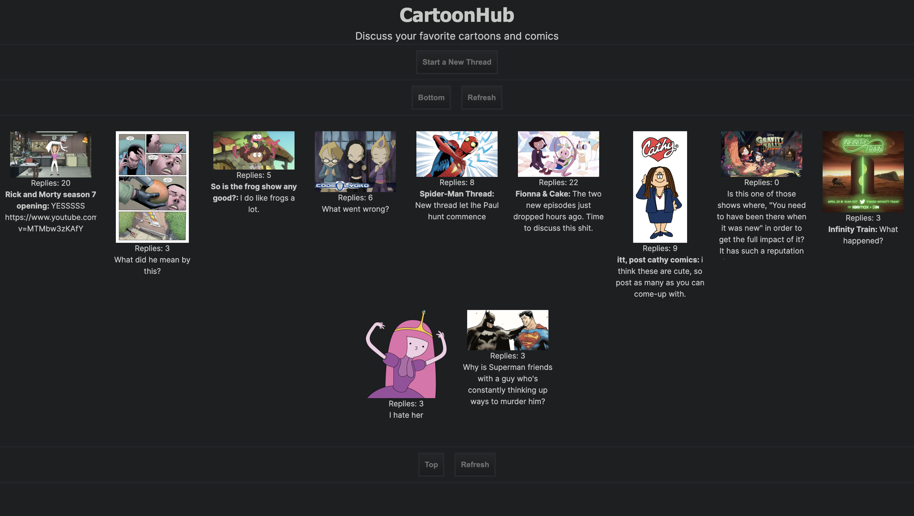
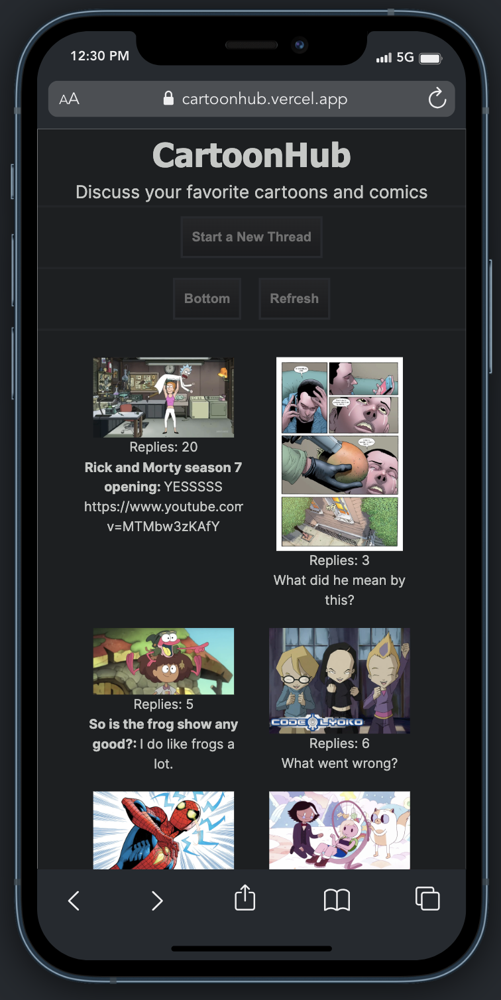
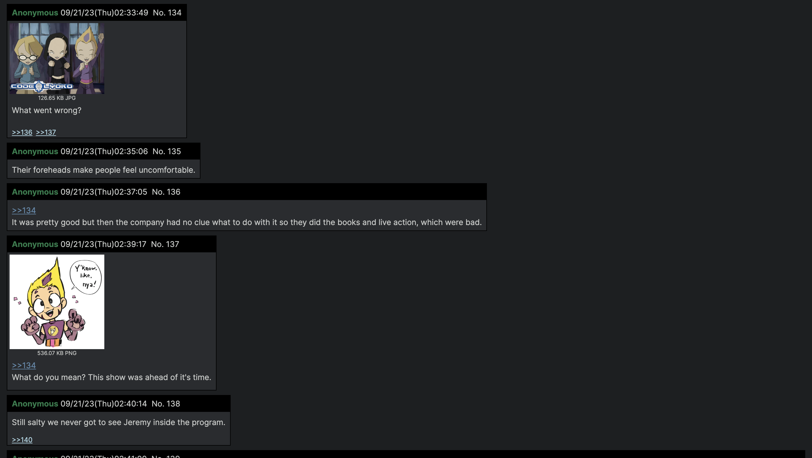
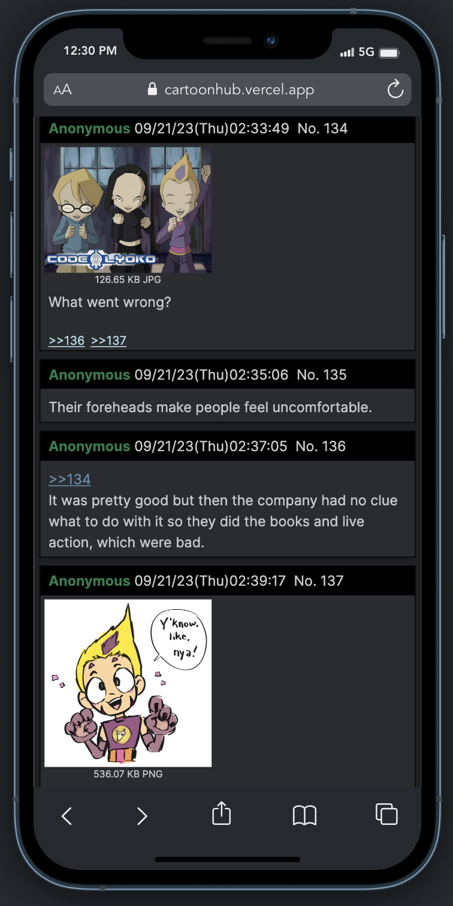
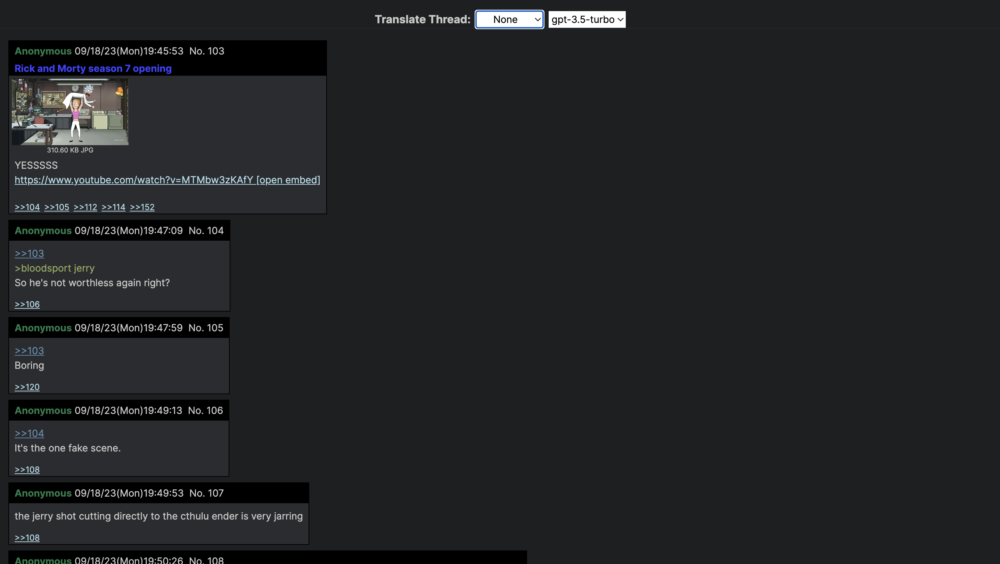
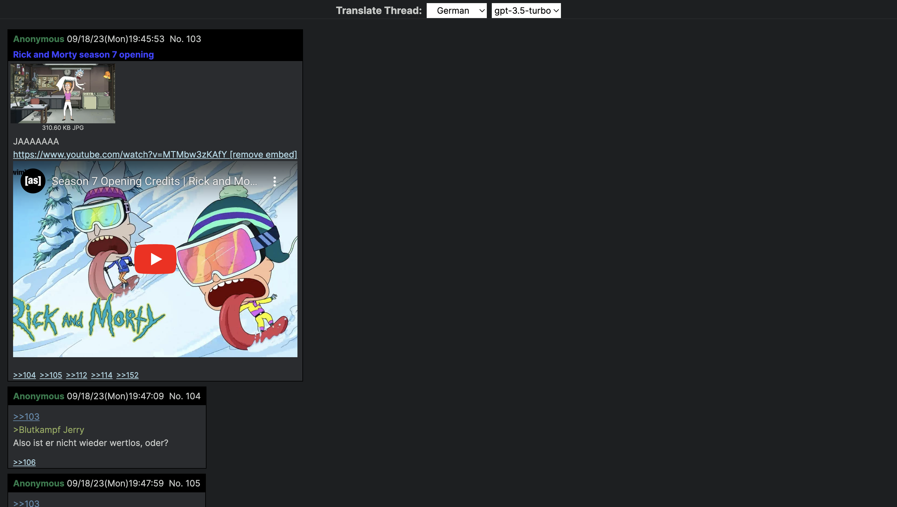
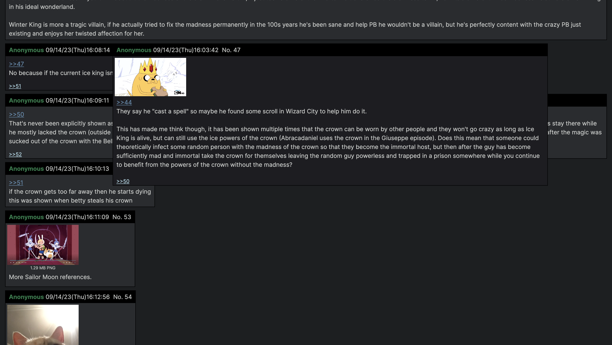

# CartoonHub

# Visit Website
Deployed Website: https://cartoonhub.vercel.app/  

# Project Description
A full CRUD web application that let's users create threads to talk about their favorite cartoons and comics.

# Technology USed
-HTML   
-CSS  
-Javascript     
-React  
-Next JS  
-Tailwind CSS  
-Node JS  
-Express JS  
-MongoDB  
-OpenAI API  
-Cloudinary API (For image hosting)

# Landing Page  
Users can create threads, or go to an existing thread  
-Full Screen  
  

-Mobile Screen  
  
  
# Thread Page  
Users can make a reply to a thread  
-Full Screen  
  

-Mobile Screen  

  
# AI Translating  
Users can translate all posts on a thread to any language of their choosing, no matter the language of the original post. I used the OpenAI API to create a bot that's capable of detecting the language of a post translating it to the desired language, and then it sends the translation data to the frontend.  

gpt-3.5-turbo is faster but less accurate  
gpt-4 is slower but more accurate

-Before
  

-After  
  

# Automatic YouTube embedding feature  
User's can include YouTube links in their posts. Doing so will automatically change it into a link to the original video, along with an option to embed the video on the site itself  
  

# Thread Rules  
-Threads on the landing page are ordered by the date of that thread's last reply. From earliest to latest.  

-Only a maximum of 20 threads can be on the landing page at a time.  

-If a new thread is made while there are 20 threads on the landing page, the last thread gets deleted.  

-Starting a line in your post with ">" will turn that line into a quote and change the text color to green.  

-Include >>(postnumber) in your post to make that part of your post a direct reply. Direct reply text are changed to blue, clicking on them sends you to that post, and hovering over them shows you a preview of that post. Clicking on a post's postnumber will automatically include a direct reply to that post.  

